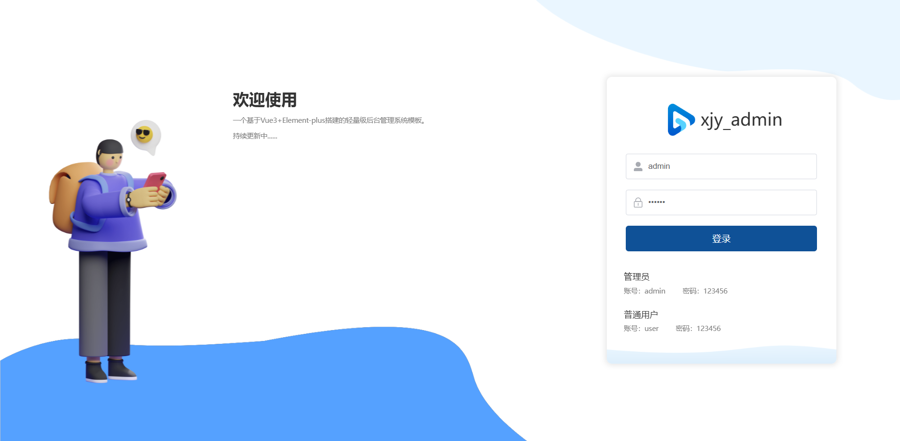
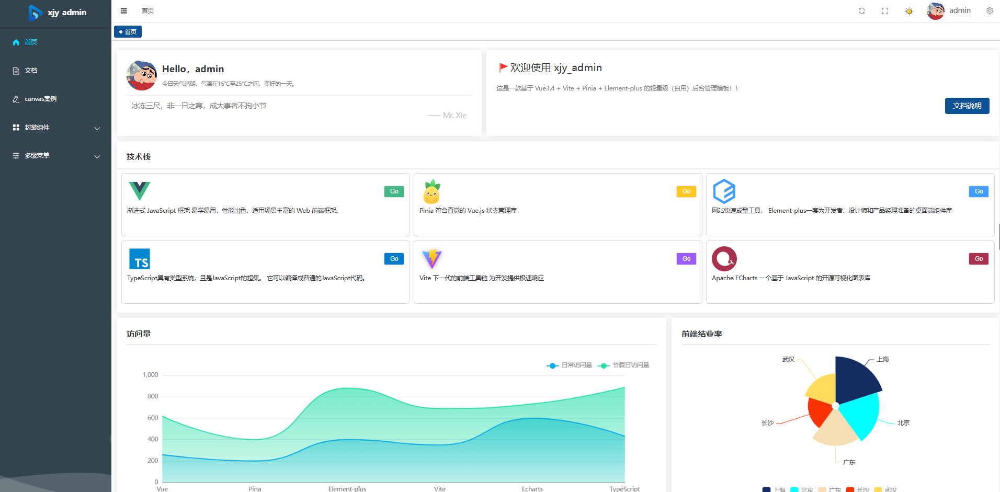

 

  
 

 <h1 align="center" style="margin: 30px 0 30px;display: flex;align-items: center;font-weight: bold;">
 xjy_admin
 </h1>

一个基于Vue3+Element-plus+TypeScript搭建的轻量级（通用）后台管理系统模板，本模板相比其他后台管理模板，集成的插件和封装功能比较少，简单，通俗易懂。

    
    
    
    
    
    
    

## 特性

- 前端：Vue3+Element-plus+Vite
- 后端：无后端（项目采用mockjs模拟数据）
- 项目基本结构：

## 预览

xjy_admin提供了以下演示和文档资源:

- 账户信息：(管理员)账号：admin，密码：123456
- 账户信息: (普通用户) 账号：user，密码：123456
- 在线地址：[xjy_admin](https://dragon-xjy.atomgit.net/xjy-admin/#/home)
- 文档地址：[xjy_admin](https://juejin.cn/post/7380283122489081856)

## 效果展示

